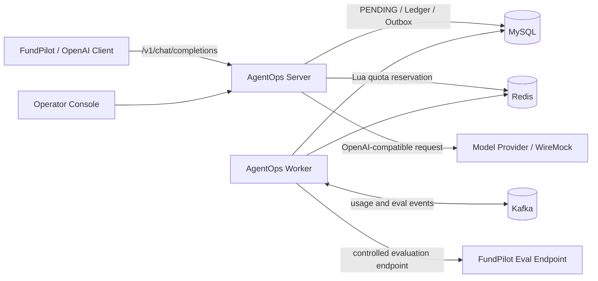

# AgentOps Lite

面向 Java Agent 后端场景的轻量治理平台：在不改动 OpenAI 客户端协议的前提下，为模型调用提供 **Token/并发额度控制、可审计用量账本、Prompt 确定性评测门禁、稳定灰度和快速回滚**。

它不是一个 Agent 聊天页面，也不试图替代业务 Agent。AgentOps Lite 位于业务 Agent 与模型 Provider 之间，解决 Agent 上线后“调用是否失控、费用是否可追溯、Prompt 改动能否安全发布”三个工程问题。

## 能解决什么问题

| 问题 | AgentOps Lite 的处理方式 |
|---|---|
| 多轮 Agent 一次运行会触发多少模型调用 | 使用 Correlation ID 聚合调用，同时按每次请求独立结算 |
| 并发请求是否会突破额度 | MySQL 先记事实，Redis Lua 原子预占 Token 与并发许可 |
| SSE 中途断开是否泄漏额度 | 响应取消不取消独立结算，Worker 扫描过期状态兜底 |
| Kafka 重复投递是否重复记账 | 不可变 Ledger + 业务唯一键 + 幂等 Projection |
| Prompt 修改后质量是否退化 | Stable/Candidate 使用同一数据集执行确定性四维评分 |
| 新 Prompt 是否可以直接全量 | Gate 通过后才能创建 0%/5%/100% Release |
| 灰度用户是否反复切换版本 | `SHA-256(subjectKey:releaseId)` 提供稳定分桶 |
| 发布异常如何恢复 | 回滚 Release 后，新的 Prompt 解析立即返回 Stable |

## 系统架构



系统只包含两个运行进程：

- `agentops-server`：OpenAI 兼容网关、配额预占、结算、Prompt/评测/发布控制面和轻量控制台。
- `agentops-worker`：Outbox 转发、Kafka 幂等投影、过期 Reservation 补偿和评测任务执行。

MySQL 是 Reservation、Ledger、Prompt、Eval 和 Release 的事实源；Redis 只保存在线额度与许可；Kafka 用于可恢复的异步投影和评测分发。详细取舍见 [ADR-001](docs/ADR-001-scope-and-consistency.md)。

## 两条核心证据链

### 在线调用与账本

```text
API Key → MySQL PENDING → Redis Lua 原子预占 → MySQL RESERVED
→ Provider 普通响应或 SSE → 独立结算 → 不可变 Ledger + Outbox
→ Kafka → 幂等 Projection
```

### Prompt 评测与发布

```text
Stable/Candidate 不可变版本 → 12 条确定性 Dataset → 24 个评测任务
→ 工具选择/参数/证据/答案约束评分 → 安全、质量和 Token 增长 Gate
→ 5% 稳定灰度 → 全量或回滚
```

## 技术栈

- Java 21、Spring Boot 3.5、WebFlux、JDBC
- MySQL 8.4、Redis 7.4、Kafka 3.9
- Redis Lua、Transactional Outbox、Flyway
- Resilience4j、Micrometer、Prometheus
- JUnit 5、Testcontainers、WireMock、Awaitility、Gatling
- Docker Compose、PowerShell

## 环境要求

- JDK 21 或更高版本
- Maven 3.9 或更高版本
- Docker Desktop / Docker Engine，支持 `docker compose`
- Windows PowerShell 5.1 或 PowerShell 7（运行演示脚本时）

先检查本机环境：

```powershell
.\scripts\check-environment.ps1
```

项目通过仓库内的 `.mvn/settings.xml` 直接使用 Maven Central，不依赖开发者个人 Maven 镜像或绝对路径。

## 快速部署

### 1. 准备配置

本地演示已有安全范围内的默认值，也可以从模板创建配置：

```powershell
Copy-Item .env.example .env
```

`.env` 不会提交到 Git。用于生产或共享环境时，必须替换管理 Token、API Key、Provider Key 和数据库密码。

### 2. 启动基础设施

```powershell
.\scripts\start-local.ps1
```

该命令启动基础设施，并等待已配置健康检查的核心容器就绪：

| 服务 | 本地端口 | 用途 |
|---|---:|---|
| MySQL | 13306 | 事实源、账本、评测和发布数据 |
| Redis | 16379 | Token/并发原子预占 |
| Kafka | 19092 | 用量投影与评测任务分发 |
| WireMock | 18090 | 可复现模型 Provider |
| Toxiproxy | 18474/18091 | 延迟和断连故障注入 |

### 3. 启动 Server 和 Worker

在两个终端分别执行：

```powershell
.\scripts\run-server.ps1
```

```powershell
.\scripts\run-worker.ps1
```

健康检查：

```text
Server  http://localhost:18080/actuator/health
Worker  http://localhost:18082/actuator/health
```

控制台：<http://localhost:18080/console>

## 一键演示

### 仓库内自包含演示

下面的命令会检查环境、构建项目、启动基础设施/Server/Worker、执行在线账本验收，并在结束后自动清理：

```powershell
.\scripts\demo.ps1
```

保留进程以便打开控制台查看：

```powershell
.\scripts\demo.ps1 -KeepRunning
```

完成后使用以下命令安全停止本次演示创建的进程和容器：

```powershell
.\scripts\stop-demo.ps1
```

演示报告写入 `artifacts/demo-report.json`，进程日志写入 `.demo/`。脚本只停止自己记录的 PID，不会按名称终止其他 Java 进程。

### 包含 FundPilot 的完整发布演示

Prompt 评测需要调用 FundPilot 的受控 `agent-eval` Endpoint，因此 FundPilot 是显式的外部依赖，不包含在本仓库中。提供其仓库路径后，一键演示会额外执行 12 条数据、24 个 Stable/Candidate 结果、Gate、5% 灰度和回滚：

```powershell
.\scripts\demo.ps1 -FundAgentHome D:\path\to\jijing-agent -KeepRunning
```

也可以设置：

```powershell
$env:FUND_AGENT_HOME = 'D:\path\to\jijing-agent'
.\scripts\demo.ps1 -KeepRunning
```

不提供 FundPilot 时，报告会明确把 `evaluationRelease` 标记为 `SKIPPED`，不会用模拟结果冒充真实 Agent 编排。

## 测试与验证

快速单元测试：

```powershell
mvn test
```

完整验证：

```powershell
.\scripts\verify.ps1
```

或者直接执行：

```powershell
mvn clean verify
```

`verify` 阶段使用 Testcontainers 启动隔离的 MySQL、Redis 和 Kafka，验证：

- Provider 用量能够结算为唯一不可变 Ledger，并释放 Redis 许可。
- 相同 Idempotency Key 不会重复创建 Reservation、Ledger 或扣费。
- SSE 客户端中断后不会持续占用 Token 和并发许可。
- 相同 Kafka Ledger 事件重复投递时，Projection 只应用一次。

Docker 未运行时，集成测试会失败并提醒启动 Docker；这是为了避免 CI 在未验证真实中间件的情况下产生假绿结果。

## 单独运行验收场景

```powershell
# 在线账本
.\scripts\demo-online-ledger.ps1

# FundPilot 已运行时执行评测、灰度与回滚
.\scripts\run-evaluation-release-demo.ps1

# Provider 延迟与恢复
.\scripts\inject-provider-latency.ps1
.\scripts\clear-provider-faults.ps1

# 本机 SSE 负载
.\scripts\run-gatling.ps1
```

完整手工验收步骤见 [ACCEPTANCE.md](docs/ACCEPTANCE.md)。

## 主要管理接口

开发管理请求使用 `X-AgentOps-Admin-Token`，在线模型请求使用 Bearer API Key。

| 动作 | 接口 |
|---|---|
| 创建不可变 Prompt 版本 | `POST /internal/v1/prompts/createVersion/{promptKey}` |
| 导入评测数据集 | `POST /internal/v1/evaluations/importDataset` |
| 创建 Stable/Candidate 评测 | `POST /internal/v1/evaluations/createJob` |
| 查询任务与 Gate | `GET /internal/v1/evaluations/queryJob/{jobId}` |
| 创建灰度发布 | `POST /internal/v1/releases/createRelease` |
| 回滚发布 | `POST /internal/v1/releases/rollbackRelease/{releaseId}` |
| 查询一次 Agent 运行 | `GET /internal/v1/usage/queryRun/{correlationId}` |
| 查询账本与投影汇总 | `GET /internal/v1/usage/querySummary` |

本地开发凭据为 `agentops-dev-key` 和 `local-admin-token`，只用于本地演示。

## 目录结构

```text
agentops-contract      跨进程事件与请求契约
agentops-core          Token、评测门禁和灰度算法
agentops-server        在线网关、账本和控制面
agentops-worker        Outbox、Kafka 投影、恢复和评测执行
agentops-test-support  WireMock Fixture 与 Gatling 场景
docker                 MySQL 初始化资源
docs                   ADR 与验收说明
scripts                启动、演示、故障注入和验证脚本
```

## 一致性与诚实边界

- MySQL 是事实源；Redis 和 Kafka 都可以从数据库事实恢复。
- Redis 成功后的崩溃可以从 `PENDING` Reservation 与长生命周期 Marker 判断是否需要补偿。
- 原始 Ledger 不修改；估算用量修正通过追加 `USAGE_ADJUSTMENT` 完成。
- Kafka 投影采用至少一次投递语义，通过 Ledger ID 保证业务幂等。
- WireMock 与 Toxiproxy 证明治理逻辑可以复现，不代表生产流量。
- 确定性通道不等于真实模型质量提升。真实 Prompt 对比必须保存模型名、温度、时间和 24 条原始结果。
- V0.1 提供轻量只读控制台和回滚操作，不包含 Kubernetes、商业计费、复杂动态路由、LLM-as-Judge 或自动回滚。

## 常见问题

### Maven 仍然访问个人私有镜像

确保从仓库根目录执行 Maven。项目根目录的 `.mvn/maven.config` 会加载仓库内设置：

```powershell
mvn help:effective-settings
```

输出中应看到 `agentops-central`。

### 一键演示提示端口被占用

先查看是否有旧的演示仍在运行：

```powershell
.\scripts\stop-demo.ps1
```

脚本不会接管未知进程；如果端口属于其他程序，需要手动选择不同端口或停止该程序。

### 为什么完整评测需要另一个仓库

AgentOps Lite 负责治理，不复制 FundPilot 的基金工具、知识检索和 Agent 编排。评测 Worker 必须观察真实业务 Agent 的工具、参数、证据和答案，因此该边界被保留为显式集成依赖。
