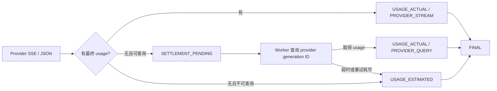

# 双模式用量结算实施说明

本版本保留“客户端断开即取消上游”的网关行为，并把用量结算与连接生命周期分开。

## 配置一个端点

迁移 `V6__add_usage_settlement_tracking.sql` 为 `provider_config` 增加以下字段：

| 字段 | 含义 |
| --- | --- |
| `settlement_mode` | `ESTIMATE_FALLBACK` 或 `QUERYABLE` |
| `usage_query_path` | 可查询端点的固定路径模板，例如 `/v1/generations/{id}` |
| `supports_stream_cancellation` | 提供商是否声明支持流取消 |

网关按项目读取启用的 `provider_config`，使用其中的 `base_url` 调用上游。只有 `QUERYABLE`、存在固定查询路径且已从响应取得 provider generation ID 时，才会创建查询任务。

## 结算流程

- SSE 解析按完整事件的原始字节边界累计；UTF-8 字符或 JSON 跨网络块不会破坏 usage 解析。原始诊断捕获上限不影响计量解析。
- 等待查询时只释放 Redis `active` 并发许可，保留 Token 预占；最终结算后才释放预占并增加 `consumed`。
- `usage_lookup_task` 与 `usage_quota_task` 都持久化在 MySQL。Worker 使用租约领取查询任务，并重试 Redis 配额操作。
- 账本只追加：实际用量写 `USAGE_ACTUAL`，到期估算写 `USAGE_ESTIMATED`，人工确认后写 `USAGE_ADJUSTMENT`。

## 运维接口

管理员接口均在 `/internal/v1/usage`：

| 用途 | 接口 |
| --- | --- |
| 查询单请求状态和来源 | `GET /queryRequest/{requestId}` |
| 查询一次 Agent 运行 | `GET /queryRun/{correlationId}` |
| 查询近期运行 | `GET /queryRecentRuns` |
| 查询账本与投影 | `GET /querySummary` |
| 追加人工校正 | `POST /adjustEstimatedRequest/{requestId}` |

请求详情区分 `execution_outcome`、`settlement_status`、`usage_source` 与 `quota_sync_status`。因此已取消的调用可以显示为 `CANCELLED`，同时在查询成功后显示结算 `FINAL`。

## 当前口径

`PROVIDER_STREAM` 和 `PROVIDER_QUERY` 是供应商确认 Token。`ESTIMATED` 使用版本化的 `heuristic-v1`：输入按请求消息的序列化文本估算，输出按已捕获的可见 delta 文本估算；它不是供应商 tokenizer 的精确结果。`MANUAL` 表示管理员以追加调整流水确认的值。

该项目目前管理 Token 配额，`cost_delta` 仍为零。要做对外商业计费，还需要独立引入价格快照、币种、税务口径、人工调整权限审计，以及各 Provider 的正式查询适配器和凭据隔离。
